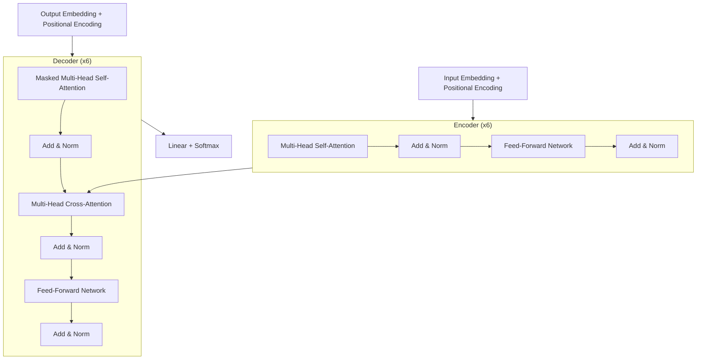

## 한 줄 요약
> Transformer는 RNN/CNN 없이 Self-Attention만으로 시퀀스 변환을 수행하는 아키텍처로, 병렬 처리가 가능해 학습 속도가 획기적으로 빨라졌다.

## 1. 논문 정보
- **제목**: Attention Is All You Need
- **저자**: Vaswani, Shazeer, Parmar, Uszkoreit, Jones, Gomez, Kaiser, Polosukhin (Google Brain / Google Research)
- **학회**: NeurIPS 2017
- **링크**: [arXiv](https://arxiv.org/abs/1706.03762)
- **보조 자료**: [The Illustrated Transformer](https://jalammar.github.io/illustrated-transformer/)

## 2. 문제 정의

기존 시퀀스 변환 모델(기계 번역 등)은 RNN(LSTM, GRU) 기반이었다. 이들의 핵심 문제점:

1. **순차적 연산**: 시퀀스를 한 토큰씩 처리하므로 병렬화 불가능 → 긴 시퀀스에서 학습 시간이 급격히 증가
2. **장거리 의존성(Long-range dependency)**: 시퀀스가 길어질수록 앞쪽 정보가 소실됨 (vanishing gradient)
3. **연산 복잡도**: Attention을 사용하더라도 RNN 위에 얹는 방식이라 근본적인 병렬화 한계 존재

**핵심 질문**: RNN/CNN 없이, Attention 메커니즘만으로 시퀀스 변환이 가능한가?

## 3. 핵심 아이디어

### 3.1 Scaled Dot-Product Attention

Attention 함수의 핵심: Query(Q)와 Key(K)의 유사도를 계산하고, 그 가중치로 Value(V)를 조합한다.

$$\text{Attention}(Q, K, V) = \text{softmax}\left(\frac{QK^T}{\sqrt{d_k}}\right)V$$

- **Q (Query)**: "내가 찾고 싶은 것"
- **K (Key)**: "각 위치가 제공하는 색인"
- **V (Value)**: "실제 정보"
- **$\sqrt{d_k}$로 나누는 이유**: $d_k$가 클 때 dot product 값이 커지면 softmax가 극단적 분포가 됨 → gradient vanishing. 스케일링으로 이를 방지

### 3.2 Multi-Head Attention

하나의 Attention 대신 $h$개의 서로 다른 선형 투영(projection)을 사용하여 다양한 관점에서 정보를 추출한다.

$$\text{MultiHead}(Q, K, V) = \text{Concat}(\text{head}_1, ..., \text{head}_h)W^O$$

$$\text{where head}_i = \text{Attention}(QW_i^Q, KW_i^K, VW_i^V)$$

논문에서는 $h=8$, $d_k = d_v = d_{model}/h = 64$를 사용했다.

**직관**: 한 head는 문법적 관계를, 다른 head는 의미적 관계를 포착할 수 있다.

### 3.3 Positional Encoding

Transformer는 순서 정보가 없으므로 위치 정보를 명시적으로 주입해야 한다.

$$PE_{(pos, 2i)} = \sin(pos / 10000^{2i/d_{model}})$$

$$PE_{(pos, 2i+1)} = \cos(pos / 10000^{2i/d_{model}})$$

**왜 sin/cos인가?**
- 어떤 고정된 오프셋 $k$에 대해 $PE_{pos+k}$를 $PE_{pos}$의 선형 함수로 표현 가능 → 모델이 상대적 위치를 학습할 수 있음
- 학습 가능한 위치 임베딩과 성능 비슷하지만, 학습 시 보지 못한 길이에 대해 일반화 가능

## 4. 아키텍처

### 전체 구조: Encoder-Decoder

### Encoder
- 6개의 동일한 레이어 스택
- 각 레이어: Multi-Head Self-Attention + Position-wise FFN
- 모든 서브레이어에 잔차 연결(Residual Connection) + Layer Normalization

### Decoder
- 6개의 동일한 레이어 스택
- Encoder와 다른 점:
  1. **Masked Self-Attention**: 미래 토큰을 보지 못하게 마스킹 (auto-regressive 특성 유지)
  2. **Cross-Attention**: Encoder 출력을 K, V로, Decoder 상태를 Q로 사용

### Position-wise Feed-Forward Network

$$\text{FFN}(x) = \max(0, xW_1 + b_1)W_2 + b_2$$

- 두 개의 선형 변환 사이에 ReLU 활성화
- $d_{model} = 512$, $d_{ff} = 2048$ (4배 확장)

## 5. 실험 결과

### WMT 2014 기계 번역

| 모델 | EN-DE BLEU | EN-FR BLEU | 학습 비용 (FLOPs) |
|------|-----------|-----------|-----------------|
| 기존 SOTA | 26.36 | 41.29 | - |
| **Transformer (big)** | **28.4** | **41.0** | $2.3 \times 10^{19}$ |

- EN-DE에서 이전 SOTA 대비 **+2.0 BLEU** 개선
- EN-FR에서 이전 앙상블 모델보다 높은 성능을 **1/4 학습 비용**으로 달성
- Base 모델: 8 P100 GPU로 12시간, Big 모델: 3.5일

### Self-Attention의 장점 (표)

| 레이어 유형 | 레이어당 복잡도 | 순차 연산 | 최대 경로 길이 |
|------------|---------------|---------|-------------|
| Self-Attention | $O(n^2 \cdot d)$ | $O(1)$ | $O(1)$ |
| RNN | $O(n \cdot d^2)$ | $O(n)$ | $O(n)$ |
| CNN | $O(k \cdot n \cdot d^2)$ | $O(1)$ | $O(\log_k(n))$ |

- 시퀀스 길이 $n < d$ (일반적)일 때 Self-Attention이 더 빠름
- **최대 경로 길이 $O(1)$**: 어떤 두 토큰이든 한 번의 attention으로 직접 연결 → 장거리 의존성 문제 해결

## 6. 한계점 & 후속 연구

### 한계점
1. **$O(n^2)$ 메모리/연산 복잡도**: 시퀀스 길이에 대해 제곱으로 증가 → 긴 문서 처리 어려움
2. **고정된 Positional Encoding**: 학습 데이터보다 긴 시퀀스에 대한 일반화 논란
3. **Pre-training 없음**: 이 논문은 supervised learning만 다룸

### 후속 연구
- **BERT (2018)**: Transformer Encoder + MLM으로 사전학습 → NLU 혁신
- **GPT (2018~)**: Transformer Decoder로 auto-regressive 사전학습 → 생성 모델
- **Longformer, BigBird**: $O(n^2)$ → $O(n)$ 효율적 Attention
- **RoPE, ALiBi**: 개선된 위치 인코딩 (현재 LLM의 표준)
- **Flash Attention**: 하드웨어 최적화로 Attention 연산 가속

## 7. 내 프로젝트와의 연결

- **AgentFlow/DDokSoRi**: LangGraph 기반 멀티에이전트 시스템에서 사용하는 LLM들(GPT-4, Claude)은 모두 Transformer 아키텍처 기반
- **SMS-Filtering**: KoBERT/KoELECTRA는 Transformer의 Encoder 부분을 사전학습한 모델
- Transformer의 Attention 메커니즘을 이해하면, 모델이 어떤 토큰에 주목하는지 해석(Attention visualization) 가능

## 8. 면접 예상 질문 & 답변

### Q1: Self-Attention의 시간복잡도는? 왜 문제가 되나요?
**A**: $O(n^2 \cdot d)$입니다. 시퀀스 길이 $n$에 대해 제곱으로 증가하므로, 긴 문서(수천 토큰 이상)를 처리할 때 메모리와 연산 비용이 급격히 늘어납니다. 이를 해결하기 위해 Longformer(sparse attention), Flash Attention(하드웨어 최적화) 등이 제안되었습니다.

### Q2: 왜 RNN 대신 Transformer를 사용하나요?
**A**: 세 가지 핵심 이유가 있습니다.
1. **병렬화**: RNN은 순차 처리($O(n)$ sequential ops)이지만, Self-Attention은 모든 위치를 동시에 처리($O(1)$ sequential ops)
2. **장거리 의존성**: RNN은 정보 전달 경로가 $O(n)$이지만, Attention은 $O(1)$로 직접 연결
3. **학습 효율**: 같은 성능을 1/4 비용으로 달성 (논문 실험 결과)

### Q3: Multi-Head Attention은 왜 필요한가요?
**A**: 단일 Attention은 하나의 관점으로만 정보를 집약합니다. Multi-Head는 서로 다른 부분 공간에서 다양한 패턴(문법적 관계, 의미적 유사성, 위치적 근접성 등)을 동시에 포착할 수 있어, 표현력이 크게 향상됩니다.

---

*참고 자료: [The Illustrated Transformer](https://jalammar.github.io/illustrated-transformer/) | [원문](https://arxiv.org/abs/1706.03762)*
