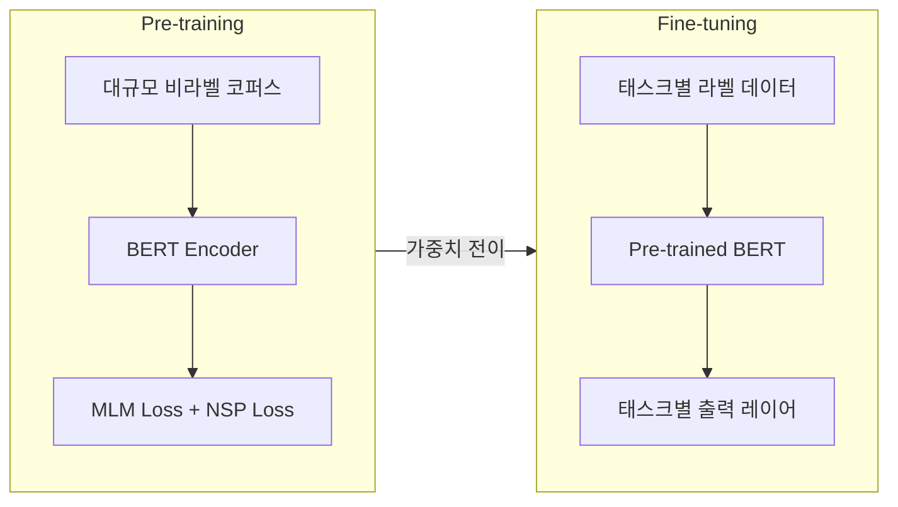

## 한 줄 요약
> BERT는 Transformer Encoder를 양방향으로 사전학습하여, 다양한 NLU 태스크에 fine-tuning만으로 SOTA를 달성한 모델이다.

## 1. 논문 정보
- **제목**: BERT: Pre-training of Deep Bidirectional Transformers for Language Understanding
- **저자**: Devlin, Chang, Lee, Toutanova (Google AI Language)
- **학회**: NAACL 2019
- **링크**: [arXiv](https://arxiv.org/abs/1810.04805)
- **보조 자료**: [The Illustrated BERT](https://jalammar.github.io/illustrated-bert/) / [FaceRain 한국어 리뷰](https://facerain.club/bert-paper/)

## 2. 문제 정의

사전학습 언어모델(Pre-trained LM)의 두 가지 접근법이 있었다:

1. **Feature-based (ELMo)**: 사전학습된 표현을 특징으로 추출하여 다른 모델의 입력으로 사용
2. **Fine-tuning (GPT)**: 사전학습 후 태스크별 레이어만 추가하여 전체 모델을 미세조정

**GPT의 한계**: 단방향(left-to-right)으로만 학습 → 각 토큰이 왼쪽 문맥만 참조 가능. 문장 수준 태스크(QA, NLI)에서 양방향 문맥이 중요한데 이를 활용하지 못함.

**핵심 질문**: 양방향(bidirectional) 사전학습이 가능한가? 그것이 성능을 크게 개선하는가?

## 3. 핵심 아이디어

### 3.1 Masked Language Model (MLM)

양방향 학습의 핵심 트릭: 입력 토큰의 15%를 무작위로 마스킹하고, 마스킹된 토큰을 예측한다.

**마스킹 전략** (15% 중):
- 80%: `[MASK]` 토큰으로 교체
- 10%: 랜덤 토큰으로 교체
- 10%: 원래 토큰 유지

**왜 이런 비율인가?**
- 100% `[MASK]`만 쓰면: Fine-tuning 시에는 `[MASK]`가 없으므로 pre-train/fine-tune 불일치(mismatch) 발생
- 랜덤 교체와 유지를 섞어 모델이 모든 위치에서 원래 토큰을 예측하도록 강제

### 3.2 Next Sentence Prediction (NSP)

두 문장 A, B가 연속된 문장인지(IsNext) 아닌지(NotNext) 이진 분류:

```
[CLS] 나는 학교에 갔다 [SEP] 거기서 친구를 만났다 [SEP] → IsNext
[CLS] 나는 학교에 갔다 [SEP] 고양이는 귀엽다 [SEP] → NotNext
```

**목적**: 문장 간 관계 이해 (QA, NLI 등에 필요)

> 참고: 후속 연구(RoBERTa)에서 NSP가 불필요하거나 오히려 해롭다는 결과가 나옴

### 3.3 입력 표현

각 토큰의 입력 = Token Embedding + Segment Embedding + Position Embedding

- **Token Embedding**: WordPiece 토크나이저 (30,000 vocab)
- **Segment Embedding**: 문장 A인지 B인지 구분
- **Position Embedding**: 학습 가능한 위치 임베딩 (Transformer 원논문의 sin/cos와 다름)
- **[CLS]**: 문장 시작, 분류 태스크에서 전체 시퀀스의 대표 벡터로 사용
- **[SEP]**: 문장 구분자

## 4. 아키텍처

### Pre-training vs Fine-tuning



### 모델 크기

| | BERT-Base | BERT-Large |
|---|---------|-----------|
| Layers (L) | 12 | 24 |
| Hidden size (H) | 768 | 1024 |
| Attention heads (A) | 12 | 16 |
| Parameters | 110M | 340M |

### Fine-tuning 방식

| 태스크 유형 | 입력 형태 | 출력 활용 |
|-----------|---------|---------|
| 문장 분류 (SST-2) | `[CLS] 문장 [SEP]` | [CLS] 벡터 → 분류기 |
| 문장 쌍 분류 (MNLI) | `[CLS] 문장A [SEP] 문장B [SEP]` | [CLS] 벡터 → 분류기 |
| 질의응답 (SQuAD) | `[CLS] 질문 [SEP] 지문 [SEP]` | 각 토큰 → 시작/끝 위치 예측 |
| 개체명 인식 (NER) | `[CLS] 문장 [SEP]` | 각 토큰 → 태그 예측 |

## 5. 실험 결과

### GLUE 벤치마크

| 태스크 | 이전 SOTA | BERT-Large |
|-------|---------|-----------|
| MNLI | 80.6 | **86.7** |
| QQP | 66.1 | **72.1** |
| SST-2 | 93.2 | **94.9** |
| GLUE 평균 | 75.1 | **82.1** |

### SQuAD v1.1 (질의응답)

| 모델 | F1 |
|------|-----|
| 이전 SOTA | 89.3 |
| BERT-Large | **93.2** |

### Ablation Study (핵심!)

| 모델 | MNLI | SST-2 |
|------|------|-------|
| BERT-Base | 84.4 | 93.5 |
| No NSP | 83.9 | 93.1 |
| LTR (left-to-right, GPT처럼) | 82.1 | 92.1 |
| + BiLSTM | 82.1 | 92.4 |

→ **양방향성(Bidirectional)이 가장 큰 성능 차이를 만든다**는 것을 증명

## 6. 한계점 & 후속 연구

### 한계점
1. **[MASK] 토큰 불일치**: Pre-training에서만 존재하는 [MASK]가 fine-tuning과의 차이를 만듦
2. **15% 마스킹의 비효율**: 한 번에 15%만 예측 → 학습 효율이 auto-regressive 모델보다 낮음
3. **토큰 독립 가정**: 마스킹된 토큰들이 서로 독립이라고 가정 (실제로는 상관관계 있음)
4. **NSP의 실효성**: 문장 단위가 아닌 주제 차이만 학습한다는 비판

### 후속 연구
- **RoBERTa (2019)**: NSP 제거, 더 많은 데이터/배치/시간으로 학습 → 일관된 개선
- **ALBERT (2019)**: 파라미터 공유로 모델 경량화
- **ELECTRA (2020)**: MLM 대신 Replaced Token Detection → 효율적 학습
- **KoBERT, KoELECTRA**: 한국어 특화 사전학습 모델

## 7. 내 프로젝트와의 연결

### SMS-Filtering 프로젝트
- **KoBERT**와 **KoELECTRA**를 사용하여 스팸 SMS를 분류
- BERT의 [CLS] 토큰 위에 분류 헤드를 추가하는 표준적인 fine-tuning 패턴 활용
- 한국어 토크나이저의 WordPiece 특성상 형태소 분석 결과와 차이가 있어 전처리 실험 진행
- KoELECTRA가 KoBERT보다 나은 성능을 보인 경험 → ELECTRA의 효율적 학습 방식 때문으로 분석

### AgentFlow/DDokSoRi
- RAG 파이프라인에서 문서 임베딩 시 BERT 계열 인코더(Sentence-BERT 등) 활용
- 의미적 유사도 검색의 기반이 되는 모델 아키텍처

## 8. 면접 예상 질문 & 답변

### Q1: BERT와 GPT의 핵심 차이는?
**A**: 세 가지 차이가 있습니다.
1. **방향성**: BERT는 양방향(bidirectional), GPT는 단방향(left-to-right)
2. **학습 목표**: BERT는 MLM(마스크 예측), GPT는 다음 토큰 예측(autoregressive)
3. **활용**: BERT는 이해(NLU) 태스크에 강하고, GPT는 생성(NLG) 태스크에 강함

구조적으로 BERT는 Transformer Encoder, GPT는 Transformer Decoder를 사용합니다.

### Q2: [CLS] 토큰의 역할은?
**A**: [CLS]는 BERT의 입력 맨 앞에 추가되는 특수 토큰입니다. Self-Attention을 통해 전체 시퀀스의 정보가 이 토큰에 집약되므로, fine-tuning 시 문장/문서 수준 분류 태스크의 대표 벡터로 사용됩니다. NSP pre-training에서도 이 벡터로 이진 분류를 수행합니다.

### Q3: KoBERT에서 겪은 tokenizer 이슈는?
**A**: KoBERT의 SentencePiece 토크나이저는 한국어 형태소 분석 결과와 다른 서브워드 분할을 합니다. 예를 들어 "학교에서"를 형태소 분석기는 "학교/에서"로 분리하지만, SentencePiece는 "학교에/서" 등 다르게 분할할 수 있습니다. 이러한 불일치가 특정 태스크(NER 등)에서 성능 저하를 유발할 수 있어, 형태소 전처리 후 토크나이징하는 방식도 실험했습니다.

---

*참고 자료: [The Illustrated BERT](https://jalammar.github.io/illustrated-bert/) | [원문](https://arxiv.org/abs/1810.04805)*
