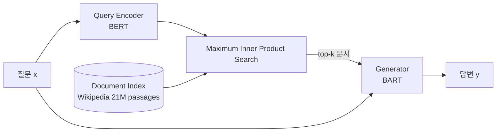

## 한 줄 요약
> RAG는 외부 지식 검색(Retrieval)과 텍스트 생성(Generation)을 결합하여, 모델의 파라메트릭 지식 한계를 극복하는 프레임워크이다.

## 1. 논문 정보
- **제목**: Retrieval-Augmented Generation for Knowledge-Intensive NLP Tasks
- **저자**: Lewis, Perez, Piktus, Petroni, Karpukhin, Goyal, Kiela, et al. (Facebook AI Research)
- **학회**: NeurIPS 2020
- **링크**: [arXiv](https://arxiv.org/abs/2005.11401)
- **보조 자료**: [Prompt Engineering Guide KR](https://www.promptingguide.ai/kr/research/rag)

## 2. 문제 정의

대규모 사전학습 언어모델(LLM)은 파라미터에 지식을 저장(parametric memory)한다. 이 방식의 문제점:

1. **지식 업데이트 불가**: 학습 이후 새로운 정보를 반영하려면 재학습 필요
2. **Hallucination**: 모델이 알지 못하는 내용을 그럴듯하게 생성
3. **지식 출처 불투명**: 어떤 근거로 답변했는지 추적 불가
4. **도메인 특화 어려움**: 특정 분야의 지식이 학습 데이터에 부족할 수 있음

**핵심 질문**: 외부 지식 저장소를 검색하여 생성에 활용하면, 이 문제들을 해결할 수 있는가?

## 3. 핵심 아이디어

### 3.1 Parametric vs Non-parametric Memory

| | Parametric (모델 가중치) | Non-parametric (외부 지식) |
|---|----------------------|------------------------|
| 저장 위치 | 모델 파라미터 | 외부 문서 인덱스 (Wikipedia 등) |
| 업데이트 | 재학습 필요 | 문서 교체만으로 가능 |
| 투명성 | 블랙박스 | 출처 추적 가능 |
| 예시 | GPT, BERT의 지식 | RAG의 검색 결과 |

**RAG = Parametric(Generator) + Non-parametric(Retriever)**

### 3.2 아키텍처 구성요소

1. **Query Encoder** ($q$): 입력 질문을 벡터로 변환 (BERT 기반)
2. **Document Index**: Wikipedia 등 대규모 문서를 미리 인코딩한 벡터 DB
3. **Retriever** ($p_\eta$): DPR(Dense Passage Retrieval)로 관련 문서 검색
4. **Generator** ($p_\theta$): BART 기반, 검색된 문서와 질문을 입력으로 답변 생성

### 3.3 RAG-Sequence vs RAG-Token

**RAG-Sequence**: 하나의 검색 문서로 전체 시퀀스를 생성한 뒤 marginalize

$$p_{\text{RAG-Sequence}}(y|x) \approx \sum_{z \in \text{top-k}} p_\eta(z|x) \prod_{i=1}^{N} p_\theta(y_i|x, z, y_{1:i-1})$$

**RAG-Token**: 각 토큰 생성 시마다 다른 문서를 참조 가능

$$p_{\text{RAG-Token}}(y|x) \approx \prod_{i=1}^{N} \sum_{z \in \text{top-k}} p_\eta(z|x) p_\theta(y_i|x, z, y_{1:i-1})$$

**직관적 차이**:
- RAG-Sequence: "하나의 참고 자료로 답변 전체를 작성"
- RAG-Token: "단어마다 가장 적절한 참고 자료를 선택"

## 4. 아키텍처

### 학습 방법

- **End-to-end 학습**: Retriever와 Generator를 동시에 학습
- Document Encoder는 고정 (FAISS 인덱스 재구축 비용 때문)
- Query Encoder와 Generator만 역전파로 업데이트
- 손실 함수: 정답 시퀀스의 negative marginal log-likelihood

## 5. 실험 결과

### Open-Domain QA

| 모델 | Natural Questions (EM) | TriviaQA (EM) | WebQuestions (EM) |
|------|----------------------|--------------|-----------------|
| REALM | 40.4 | - | 40.7 |
| DPR + BART | 41.5 | 56.8 | 42.4 |
| **RAG-Token** | **44.5** | **56.8** | **45.5** |
| **RAG-Sequence** | 44.1 | 56.1 | 45.2 |

### Abstractive QA (MSMARCO)

| 모델 | BLEU-1 | Rouge-L |
|------|--------|---------|
| BART | 33.0 | 44.1 |
| **RAG-Token** | **36.5** | **44.7** |

### Fact Verification (FEVER)

| 모델 | Accuracy |
|------|---------|
| BERT (supervised) | 71.1 |
| **RAG-Sequence** | **72.5** |

→ 레이블 없이도 supervised 모델과 비슷하거나 더 나은 성능

### 지식 생성 (Jeopardy Question Generation)

RAG 모델이 생성한 문장이 더 factual하고 specific하다는 인간 평가 결과

## 6. 한계점 & 후속 연구

### 한계점
1. **검색 품질 의존성**: Retriever가 잘못된 문서를 가져오면 Generator도 오답 생성
2. **Document Index 고정**: 학습 중 문서 인코더를 업데이트하지 않아 최적화 한계
3. **레이턴시**: 검색 + 생성으로 순수 생성 모델보다 느림
4. **청크 크기 고정**: 100-word 패시지 고정 → 최적 크기가 태스크마다 다를 수 있음

### 후속 연구
- **RETRO (2022)**: 더 큰 규모에서의 retrieval-augmented 사전학습
- **Atlas (2022)**: few-shot에서 강력한 retrieval-augmented 모델
- **Self-RAG (2023)**: 검색 필요성을 모델이 스스로 판단
- **현대 RAG 시스템**: LangChain, LlamaIndex 등의 프레임워크로 실용화
- **Agentic RAG**: 에이전트가 검색 전략을 동적으로 결정

## 7. 내 프로젝트와의 연결

### AgentFlow
- LangGraph 기반 멀티에이전트 시스템에서 RAG 파이프라인 구현
- 논문의 DPR처럼 문서를 벡터화하여 유사도 검색 수행
- 실제로는 OpenAI Embeddings + Pinecone/ChromaDB 조합 사용

### DDokSoRi
- 음성 기반 AI 비서에서 RAG를 활용하여 도메인 특화 응답 생성
- 논문의 RAG-Sequence와 유사하게, 검색된 컨텍스트를 프롬프트에 주입하는 방식
- Hallucination 감소를 위해 검색 결과의 relevance score 기반 필터링 적용

### 실무 교훈
- 논문에서는 Wikipedia 전체를 사용했지만, 실제 서비스에서는 **도메인 특화 문서**로 한정하는 것이 성능과 비용 면에서 유리
- Chunking 전략(크기, 오버랩)이 검색 품질에 큰 영향을 미침 → 논문의 고정 100-word 방식보다 유연한 접근 필요

## 8. 면접 예상 질문 & 답변

### Q1: RAG의 장단점은 무엇인가요?
**A**:
**장점**: (1) 외부 지식을 실시간으로 활용하여 hallucination 감소, (2) 문서 교체만으로 지식 업데이트 가능 (재학습 불필요), (3) 답변의 근거(출처)를 제시할 수 있어 신뢰성 향상
**단점**: (1) 검색 품질에 성능이 크게 좌우됨, (2) 추가적인 인프라(벡터 DB, 임베딩 모델) 필요, (3) 레이턴시 증가

### Q2: Hallucination을 어떻게 줄이나요?
**A**: RAG에서 hallucination을 줄이는 방법:
1. **검색 품질 향상**: 더 나은 임베딩 모델, re-ranking, hybrid search(키워드 + 시맨틱)
2. **프롬프트 엔지니어링**: "제공된 컨텍스트에만 기반하여 답변하세요" 같은 지시
3. **Self-RAG**: 모델이 검색 필요성과 답변 품질을 스스로 평가
4. **Citation 강제**: 답변에 출처를 명시하도록 하여 근거 없는 생성 억제
5. **Relevance filtering**: 검색 결과의 유사도 점수가 임계값 이하면 "모른다"고 답변

### Q3: RAG-Sequence와 RAG-Token의 차이를 설명해주세요.
**A**: RAG-Sequence는 하나의 검색 문서를 선택하고 그 문서만을 참조하여 전체 답변을 생성합니다. 반면 RAG-Token은 답변의 각 토큰을 생성할 때마다 여러 문서에 대한 확률을 혼합합니다. 직관적으로, RAG-Sequence는 "하나의 참고서로 에세이 쓰기", RAG-Token은 "단어마다 가장 적절한 참고서 골라 쓰기"에 비유할 수 있습니다. Open-domain QA에서는 RAG-Token이 약간 더 좋은 성능을 보였습니다.

---

*참고 자료: [Prompt Engineering Guide KR](https://www.promptingguide.ai/kr/research/rag) | [원문](https://arxiv.org/abs/2005.11401)*
