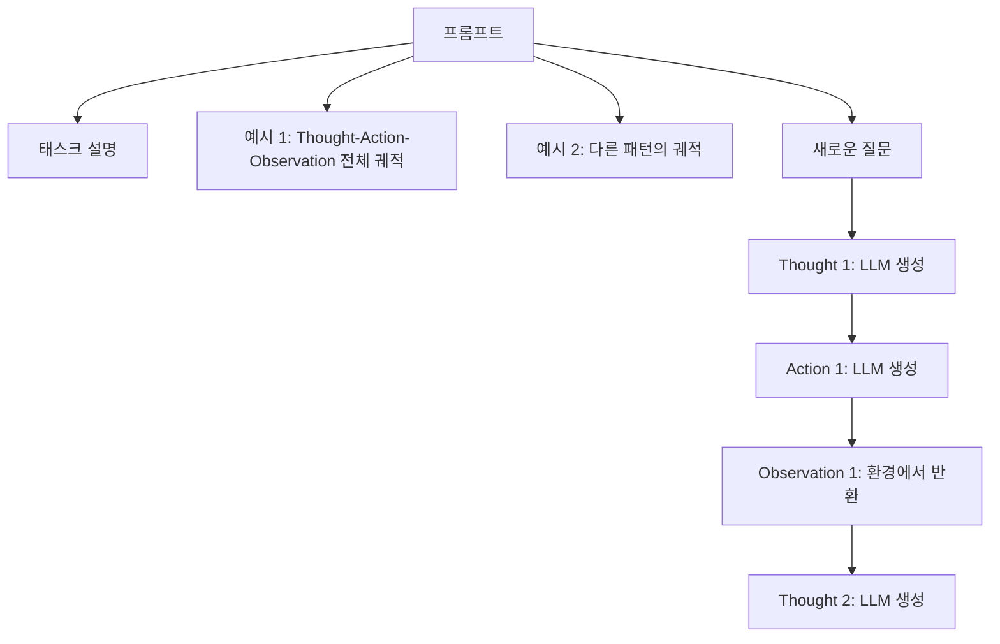

## 한 줄 요약
> ReAct는 LLM이 추론(Reasoning)과 행동(Acting)을 번갈아 수행하게 하여, 외부 도구와 상호작용하며 복잡한 태스크를 해결하는 프레임워크이다.

## 1. 논문 정보
- **제목**: ReAct: Synergizing Reasoning and Acting in Language Models
- **저자**: Yao, Zhao, Yu, Du, Shafran, Narasimhan, Cao (Princeton / Google Brain)
- **학회**: ICLR 2023
- **링크**: [arXiv](https://arxiv.org/abs/2210.03629)
- **보조 자료**: [ReAct 프로젝트 페이지](https://react-lm.github.io/) / [한국어 가이드](https://www.promptingguide.ai/kr/techniques/react)

## 2. 문제 정의

LLM을 사용한 태스크 해결의 두 가지 기존 접근법:

1. **Reasoning only (CoT)**: Chain-of-Thought로 추론만 수행 → 외부 세계와 상호작용 불가, 사실 검증 어려움
2. **Acting only (WebGPT 등)**: 도구만 사용 → 왜 그 행동을 하는지 추론 과정이 없어 오류 수정 어려움

**핵심 문제들**:
- CoT는 추론은 잘하지만 **hallucination**과 **error propagation** 문제
- Action-only는 도구를 쓰지만 **전략적 사고** 없이 맹목적 행동
- 인간은 추론과 행동을 **번갈아** 수행 (예: 요리할 때 레시피를 생각하고 → 행동하고 → 결과를 보고 → 다음 단계를 생각)

**핵심 질문**: 추론과 행동을 인터리빙(interleaving)하면 더 나은 성능을 얻을 수 있는가?

## 3. 핵심 아이디어

### 3.1 ReAct = Reasoning + Acting

기존 방법과의 비교:

| 방법 | Reasoning | Acting | 특징 |
|------|-----------|--------|------|
| Standard | X | X | 직접 답변 |
| CoT | O | X | 추론만, 외부 정보 없음 |
| Act-only | X | O | 행동만, 전략적 사고 없음 |
| **ReAct** | **O** | **O** | **추론 → 행동 → 관찰 → 추론 반복** |

### 3.2 Thought-Action-Observation 루프

```
Thought: 문제를 분석하고 다음 행동을 계획
Action: 외부 도구/환경과 상호작용 (검색, 조회 등)
Observation: 행동의 결과를 받아옴
Thought: 관찰 결과를 분석하고 다음 단계를 계획
Action: ...
(반복)
```

### 3.3 구체적 예시 (HotpotQA)

**질문**: "Apple Remote과 Siri Remote 중 어느 것이 더 많은 기기와 호환되나요?"

```
Thought 1: Apple Remote과 Siri Remote의 호환 기기 수를 각각 찾아야 한다.
Action 1: Search[Apple Remote]
Observation 1: Apple Remote은 Apple TV, Mac, iPod 등과 호환되는 리모컨이다...
Thought 2: Apple Remote의 호환 기기를 알았다. 이제 Siri Remote을 찾아보자.
Action 2: Search[Siri Remote]
Observation 2: Siri Remote은 Apple TV 4세대 이후 모델과 호환된다...
Thought 3: Apple Remote이 더 많은 기기(Apple TV, Mac, iPod 등)와 호환된다.
Action 3: Finish[Apple Remote]
```

**CoT만 사용했다면**: 정확한 호환 기기 목록 없이 추측으로 답변 → hallucination 위험

## 4. 방법론

### 태스크별 Action Space

**지식 추론 태스크 (HotpotQA, FEVER)**:
- `Search[entity]`: Wikipedia에서 검색
- `Lookup[keyword]`: 현재 문서에서 키워드 검색
- `Finish[answer]`: 최종 답변 제출

**의사결정 태스크 (ALFWorld, WebShop)**:
- 환경별 행동 (예: `go to shelf 2`, `pick up knife`, `click [Buy Now]`)
- Thought가 서브 목표 설정과 진행 상황 추적 역할

### 프롬프트 구성



- Few-shot 프롬프팅으로 구현 (1~6개 예시)
- Fine-tuning 없이 in-context learning만으로 작동
- Thought와 Action은 LLM이 생성, Observation은 환경에서 반환

### ReAct + CoT-SC (Self-Consistency)

논문에서 제안한 최적 조합:
1. ReAct로 먼저 시도
2. ReAct가 실패하면(hallucination 반복 등) CoT-SC로 전환
3. 또는 CoT-SC의 다수결 답변과 ReAct의 답변을 비교

## 5. 실험 결과

### HotpotQA (다단계 추론)

| 방법 | EM (Exact Match) |
|------|-----------------|
| Standard prompting | 25.7 |
| CoT | 29.4 |
| Act-only | 25.7 |
| **ReAct** | **27.4** |
| CoT-SC (21 samples) | 33.4 |
| **ReAct + CoT-SC** | **35.1** |

### FEVER (팩트 검증)

| 방법 | Accuracy |
|------|---------|
| Standard | 57.1 |
| CoT | 56.3 |
| Act-only | 58.9 |
| **ReAct** | **60.9** |
| CoT-SC | 64.6 |
| **ReAct + CoT-SC** | **64.6** |

### 질적 분석 (핵심!)

| 오류 유형 | CoT | ReAct |
|---------|-----|-------|
| Hallucination | 56% | **14%** |
| 추론 오류 | 47% | 47% |

→ **ReAct가 hallucination을 대폭 줄임** (외부 검색으로 사실 확인)

### ALFWorld (텍스트 기반 게임)

| 방법 | 성공률 |
|------|-------|
| Act-only (BUTLER) | 22% |
| Act-only (LLM) | 45% |
| **ReAct (LLM)** | **71%** |

→ Thought가 서브 목표를 추적하여 의사결정 크게 개선

## 6. 한계점 & 후속 연구

### 한계점
1. **프롬프트 엔지니어링 의존**: 좋은 few-shot 예시가 성능에 큰 영향
2. **추론 능력은 CoT-SC보다 낮음**: 순수 추론 벤치마크에서는 CoT-SC가 우수
3. **Action Space 설계**: 태스크마다 적절한 도구/행동 정의 필요
4. **비용**: 여러 번의 LLM 호출 + 외부 API 호출로 비용과 레이턴시 증가
5. **오류 누적**: 잘못된 검색 결과가 이후 추론에 영향

### 후속 연구
- **Reflexion (2023)**: ReAct에 자기 반성(reflection) 추가 → 실패에서 학습
- **Toolformer (2023)**: 모델이 스스로 도구 사용법을 학습
- **LangChain / LangGraph**: ReAct 패턴을 프레임워크화
- **AutoGPT, BabyAGI**: 더 자율적인 에이전트 시스템
- **Function Calling**: OpenAI, Anthropic의 도구 사용 API

## 7. 내 프로젝트와의 연결

### AgentFlow (LangGraph 멀티에이전트 시스템)
- LangGraph의 에이전트 노드는 본질적으로 **ReAct 패턴** 구현
- `state → think → act → observe → state update` 사이클이 ReAct의 Thought-Action-Observation과 정확히 대응
- 멀티에이전트에서 각 에이전트가 독립적인 ReAct 루프를 수행하며, 상위 에이전트가 조율

### DDokSoRi (음성 AI 비서)
- 사용자 질의 → 의도 파악(Thought) → API 호출(Action) → 결과 처리(Observation) → 응답 생성
- ReAct 논문의 패턴이 실제 서비스 아키텍처에 그대로 녹아 있음

### 실무 교훈
- **도구 정의가 핵심**: 어떤 도구를 줄 것인지, 도구의 설명을 어떻게 작성할 것인지가 에이전트 성능을 좌우
- **Thought의 중요성**: 단순히 도구만 쓰게 하면 맹목적 행동, Thought(추론)를 강제하면 전략적 행동
- **실패 처리**: ReAct도 검색 실패 시 루프에 빠질 수 있음 → 최대 반복 횟수, fallback 전략 필요

## 8. 면접 예상 질문 & 답변

### Q1: 에이전트가 도구를 호출하는 원리를 설명해주세요.
**A**: ReAct 패턴 기반입니다. LLM이 프롬프트에 정의된 도구 목록과 사용 형식을 보고, 현재 상황에서 필요한 도구를 선택하여 호출합니다. 구체적으로:
1. **Thought**: 현재 상황 분석 및 필요한 정보/행동 판단
2. **Action**: 도구 이름과 인자를 특정 형식으로 출력
3. **시스템**: 출력을 파싱하여 실제 도구(API) 호출
4. **Observation**: 결과를 다시 LLM에 전달
5. 반복하여 최종 답변 도출

LangGraph에서는 이 루프를 그래프의 노드와 엣지로 구조화합니다.

### Q2: ReAct와 CoT의 차이는?
**A**: CoT(Chain-of-Thought)는 모델이 내부 지식만으로 단계별 추론을 수행합니다. ReAct는 여기에 **외부 행동(Action)**을 추가하여 검색, API 호출 등으로 실시간 정보를 활용합니다. 핵심 차이는 hallucination: CoT는 56%의 오류가 hallucination이지만, ReAct는 14%로 대폭 감소합니다. 다만 순수 추론에서는 CoT-SC(Self-Consistency)가 더 우수하여, 실무에서는 둘을 결합(ReAct + CoT-SC)하는 것이 최적입니다.

### Q3: LangGraph 에이전트와 ReAct의 관계는?
**A**: LangGraph의 에이전트 노드는 ReAct 패턴의 구조적 구현입니다. ReAct의 Thought-Action-Observation 루프가 LangGraph에서는:
- **State**: 현재까지의 대화/관찰 기록
- **Agent Node**: LLM이 state를 보고 thought + action을 생성
- **Tool Node**: action을 실행하고 observation을 state에 추가
- **Conditional Edge**: 종료 조건 판단 (Finish인지 계속인지)

이 그래프 구조 덕분에 멀티에이전트, 병렬 도구 호출, 인간 검토(human-in-the-loop) 등 논문 이상의 확장이 가능합니다.

---

*참고 자료: [ReAct 프로젝트](https://react-lm.github.io/) | [원문](https://arxiv.org/abs/2210.03629)*
