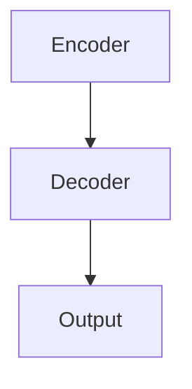
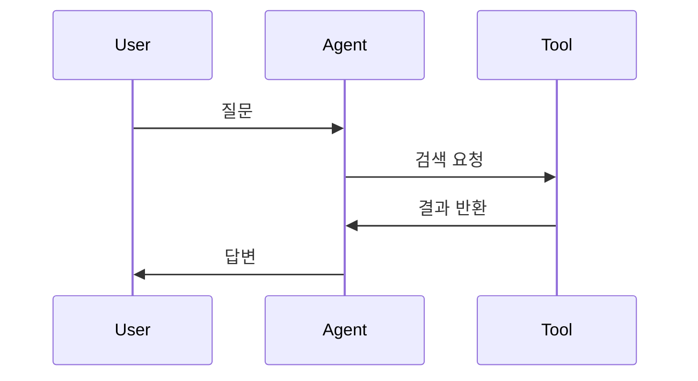

# 블로그 관리 가이드

> Jekyll + Chirpy 테마를 처음 사용하는 분을 위한 가이드입니다.

---

## 목차
1. [블로그 구조 이해하기](#1-블로그-구조-이해하기)
2. [새 포스트 작성하기](#2-새-포스트-작성하기)
3. [기존 포스트 수정하기](#3-기존-포스트-수정하기)
4. [마크다운 문법 정리](#4-마크다운-문법-정리)
5. [수식 사용하기 (LaTeX)](#5-수식-사용하기-latex)
6. [다이어그램 그리기 (Mermaid)](#6-다이어그램-그리기-mermaid)
7. [이미지 추가하기](#7-이미지-추가하기)
8. [사이트 설정 변경하기](#8-사이트-설정-변경하기)
9. [변경사항 배포하기](#9-변경사항-배포하기)
10. [자주 하는 실수 & 해결법](#10-자주-하는-실수--해결법)

---

## 1. 블로그 구조 이해하기

```
Maroco0109.github.io/
├── _posts/          ← 블로그 글이 들어가는 곳 (가장 많이 사용!)
├── _tabs/           ← 사이드바 메뉴 페이지 (About 등)
├── _config.yml      ← 블로그 전체 설정 파일
├── _data/           ← 연락처, 공유 버튼 등 데이터
├── assets/          ← 이미지, JS, CSS 등 정적 파일
│   └── img/         ← 이미지 저장 폴더
├── docs/            ← 이 가이드가 있는 곳 (빌드에 포함 안 됨)
├── index.html       ← 홈페이지 (수정할 필요 없음)
├── Gemfile          ← Ruby 의존성 (수정할 필요 없음)
└── .github/
    └── workflows/   ← GitHub Actions 배포 설정 (수정할 필요 없음)
```

**핵심**: 대부분의 작업은 `_posts/` 폴더에서 파일을 추가/수정하는 것입니다!

---

## 2. 새 포스트 작성하기

### Step 1: 파일 만들기

`_posts/` 폴더에 새 파일을 만듭니다.

**파일 이름 규칙** (매우 중요!):
```
YYYY-MM-DD-제목-영어로.md
```

예시:
```
2026-02-22-attention-is-all-you-need.md
2026-03-01-my-first-post.md
```

> ⚠️ 파일 이름에 한글, 공백, 특수문자 사용 금지! 영어 소문자 + 하이픈(-)만 사용하세요.

### Step 2: Front Matter 작성

파일 맨 위에 `---`로 감싼 설정 블록을 작성합니다. 이것을 **Front Matter**라고 합니다.

```yaml
---
title: "[논문 리뷰] 논문 제목 (연도)"    # 브라우저에 표시되는 제목 (한글 OK)
date: 2026-02-22 09:00:00 +0900          # 작성일 (반드시 +0900 붙이기)
categories: [Paper Review, NLP]           # 카테고리 (최대 2단계)
tags: [transformer, attention, nlp]       # 태그 (소문자, 여러 개 가능)
math: true                                # 수식 사용 시 true
mermaid: true                             # 다이어그램 사용 시 true
---
```

#### Front Matter 항목별 설명

| 항목 | 필수 | 설명 | 예시 |
|------|------|------|------|
| `title` | O | 포스트 제목 | `"[논문 리뷰] BERT (2018)"` |
| `date` | O | 작성 날짜+시간+타임존 | `2026-02-22 09:00:00 +0900` |
| `categories` | O | 카테고리 (대괄호) | `[Paper Review, NLP]` |
| `tags` | O | 태그 (대괄호, 소문자) | `[bert, nlp, fine-tuning]` |
| `math` | X | LaTeX 수식 사용 여부 | `true` 또는 생략 |
| `mermaid` | X | Mermaid 다이어그램 사용 여부 | `true` 또는 생략 |
| `pin` | X | 홈 상단 고정 | `true` |
| `image` | X | 포스트 대표 이미지 | `path: /assets/img/posts/xxx.png` |

### Step 3: 본문 작성

Front Matter 아래에 마크다운으로 글을 작성합니다.

```markdown
---
title: "내 첫 번째 포스트"
date: 2026-02-22 09:00:00 +0900
categories: [Blog, Tutorial]
tags: [jekyll, chirpy, blog]
---

## 제목입니다

여기에 본문을 작성합니다. 일반 마크다운 문법을 사용하면 됩니다.

### 소제목

- 목록 1
- 목록 2

**굵은 글씨**, *기울임*, `인라인 코드`
```

### 카테고리 가이드

카테고리는 계층 구조입니다. `[대분류, 소분류]` 형태로 씁니다.

```yaml
# 현재 사용 중인 카테고리
categories: [Paper Review, NLP]

# 다른 예시
categories: [Project, AgentFlow]
categories: [Study, Deep Learning]
categories: [Interview, QnA]
```

---

## 3. 기존 포스트 수정하기

1. `_posts/` 폴더에서 수정할 파일을 열어 편집합니다
2. 저장 후 git으로 커밋 & 푸시하면 자동 배포됩니다

```bash
# 예: Transformer 포스트 수정 후
cd ~/Maroco0109.github.io
git add _posts/2026-02-22-attention-is-all-you-need.md
git commit -m "Transformer 포스트 내용 보완"
git push origin main
```

> 💡 VS Code에서 `.md` 파일을 열면 미리보기(Ctrl+Shift+V)로 렌더링 확인 가능

---

## 4. 마크다운 문법 정리

### 제목

```markdown
## 2단계 제목 (포스트에서 가장 큰 제목)
### 3단계 제목
#### 4단계 제목
```

> ⚠️ `# 1단계 제목`은 사용하지 마세요. 포스트 title과 겹칩니다.

### 텍스트 꾸미기

```markdown
**굵은 글씨**
*기울임*
~~취소선~~
`인라인 코드`
```

### 링크와 이미지

```markdown
[표시 텍스트](https://url.com)

```

### 목록

```markdown
- 순서 없는 목록
- 항목 2
  - 중첩 항목

1. 순서 있는 목록
2. 항목 2
```

### 표

```markdown
| 헤더 1 | 헤더 2 | 헤더 3 |
|--------|--------|--------|
| 내용 1 | 내용 2 | 내용 3 |
| 내용 4 | 내용 5 | 내용 6 |
```

### 인용문

```markdown
> 이것은 인용문입니다.
> 여러 줄도 가능합니다.
```

### 코드 블록

````markdown
```python
def hello():
    print("Hello World!")
```
````

지원 언어: `python`, `javascript`, `bash`, `java`, `sql`, `json`, `yaml` 등

### Chirpy 전용: 프롬프트 블록

```markdown
> 정보 프롬프트
{: .prompt-info }

> 팁 프롬프트
{: .prompt-tip }

> 경고 프롬프트
{: .prompt-warning }

> 위험 프롬프트
{: .prompt-danger }
```

---

## 5. 수식 사용하기 (LaTeX)

Front Matter에 `math: true`를 추가해야 합니다.

### 인라인 수식

```markdown
문장 안에 $E = mc^2$ 수식을 넣을 수 있습니다.
```

### 블록 수식

```markdown
$$\text{Attention}(Q, K, V) = \text{softmax}\left(\frac{QK^T}{\sqrt{d_k}}\right)V$$
```

### 자주 쓰는 LaTeX 문법

| 표현 | 코드 | 결과 |
|------|------|------|
| 분수 | `\frac{a}{b}` | a/b |
| 위첨자 | `x^2` | x² |
| 아래첨자 | `x_i` | xᵢ |
| 합 | `\sum_{i=1}^{n}` | 시그마 |
| 곱 | `\prod_{i=1}^{n}` | 파이 |
| 루트 | `\sqrt{x}` | 루트 |
| 굵은 수식 | `\mathbf{W}` | 볼드 W |
| 텍스트 | `\text{softmax}` | softmax |
| 화살표 | `\rightarrow` | → |

---

## 6. 다이어그램 그리기 (Mermaid)

Front Matter에 `mermaid: true`를 추가해야 합니다.

### 플로우차트

````markdown

````

### 위에서 아래로

````markdown

````

### 시퀀스 다이어그램

````markdown

````

> 💡 [Mermaid Live Editor](https://mermaid.live/)에서 미리보기 후 복사해서 쓸 수 있습니다.

---

## 7. 이미지 추가하기

### Step 1: 이미지 파일 저장

```bash
# 이미지 폴더 만들기 (처음 한 번만)
mkdir -p assets/img/posts

# 이미지 파일을 해당 폴더에 복사
cp my-image.png assets/img/posts/
```

### Step 2: 포스트에서 참조

```markdown

_Figure 1: Transformer 전체 구조_
```

### 이미지 크기 조절

```markdown
{: width="500" }
{: width="70%" }
```

### 포스트 대표 이미지 (썸네일)

Front Matter에 추가:

```yaml
image:
  path: /assets/img/posts/thumbnail.png
  alt: "이미지 설명"
```

---

## 8. 사이트 설정 변경하기

`_config.yml` 파일을 수정합니다.

### 자주 변경하는 설정

```yaml
# 블로그 제목
title: "Jiwan Kang"

# 부제목 (사이드바에 표시)
tagline: "AI/LLM Engineer의 논문 학습 기록"

# 블로그 설명 (SEO용)
description: >-
  AI/LLM 엔지니어를 위한 핵심 논문 리뷰와 면접 준비 블로그

# 프로필 사진 추가 (선택)
avatar: "/assets/img/avatar.png"

# 테마 모드 (비워두면 자동 / light / dark)
theme_mode:

# 한 페이지에 보여줄 포스트 수
paginate: 10
```

### About 페이지 수정

`_tabs/about.md` 파일을 수정합니다.

> ⚠️ `_config.yml`을 수정하면 반드시 커밋 & 푸시해야 적용됩니다.

---

## 9. 변경사항 배포하기

### 기본 워크플로우

```bash
# 1. 블로그 폴더로 이동
cd ~/Maroco0109.github.io

# 2. 변경된 파일 확인
git status

# 3. 변경사항 스테이징
git add .
# 또는 특정 파일만: git add _posts/새파일.md

# 4. 커밋
git commit -m "새 포스트 추가: 논문 제목"

# 5. 푸시 (이게 배포 트리거!)
git push origin main
```

### 배포 과정 (자동)

```
git push → GitHub Actions 실행 → Jekyll 빌드 → GitHub Pages 배포
```

- 푸시 후 약 **30초~1분** 내에 자동 배포됩니다
- 배포 상태 확인: GitHub 리포지토리 → Actions 탭

### 배포 실패 시

```bash
# GitHub Actions 최근 실행 상태 확인
gh run list --limit 3

# 특정 실행의 로그 보기
gh run view <run-id> --log
```

---

## 10. 자주 하는 실수 & 해결법

### 포스트가 안 보여요!

| 원인 | 해결법 |
|------|--------|
| 파일 이름 형식 오류 | `YYYY-MM-DD-제목.md` 형식 확인 |
| 날짜가 미래임 | 날짜를 오늘 이전으로 수정 (또는 `_config.yml`에 `future: true`) |
| Front Matter 오류 | `---`로 시작하고 `---`로 닫혔는지 확인 |
| 파일이 `_posts` 밖에 있음 | `_posts/` 폴더 안에 있는지 확인 |

### 수식이 렌더링 안 돼요!

- Front Matter에 `math: true` 추가했는지 확인
- `$$` 블록 수식 위아래에 빈 줄이 있는지 확인

### 다이어그램이 안 나와요!

- Front Matter에 `mermaid: true` 추가했는지 확인
- mermaid 코드 블록 문법 확인 (` ```mermaid `)

### 빌드가 실패해요!

- YAML Front Matter 문법 오류 (콜론 뒤에 공백, 따옴표 짝 맞추기)
- 제목에 특수문자(`:`, `#`, `[`, `]`)가 있으면 **따옴표로 감싸기**:
  ```yaml
  title: "[논문 리뷰] Attention Is All You Need"  # OK
  title: [논문 리뷰] Attention Is All You Need     # 에러!
  ```

### 이미지가 안 보여요!

- 경로가 `/assets/img/`로 시작하는지 확인
- 파일 이름 대소문자 일치하는지 확인 (Linux는 대소문자 구분!)
- 이미지 파일을 git에 add했는지 확인

---

## 빠른 참조: 새 포스트 체크리스트

```
[ ] _posts/ 폴더에 YYYY-MM-DD-title.md 파일 생성
[ ] Front Matter 작성 (title, date, categories, tags)
[ ] 수식 있으면 math: true
[ ] 다이어그램 있으면 mermaid: true
[ ] 본문 마크다운으로 작성
[ ] git add → commit → push
[ ] 1분 후 블로그에서 확인
```

---

## 유용한 링크

- [Chirpy 테마 공식 문서](https://chirpy.cotes.page/)
- [Chirpy 포스트 작성 가이드](https://chirpy.cotes.page/posts/write-a-new-post/)
- [Chirpy 텍스트/미디어 예시](https://chirpy.cotes.page/posts/text-and-typography/)
- [마크다운 문법 참고](https://www.markdownguide.org/basic-syntax/)
- [Mermaid 공식 문서](https://mermaid.js.org/)
- [LaTeX 수식 참고](https://katex.org/docs/supported)
